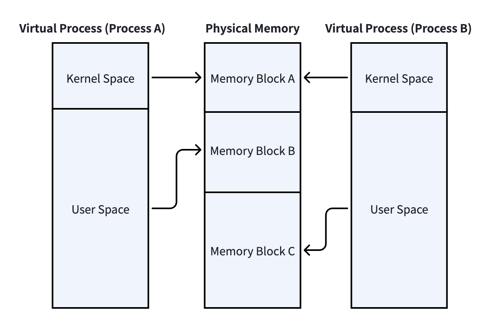
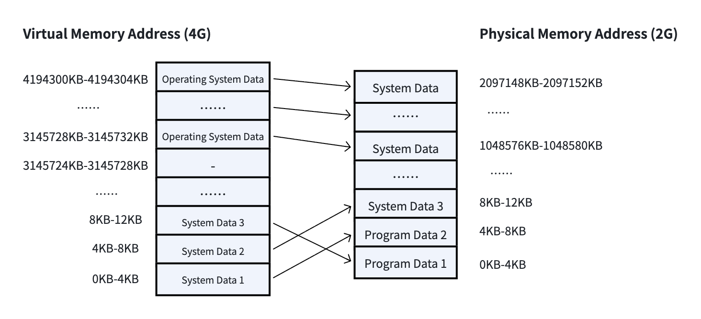
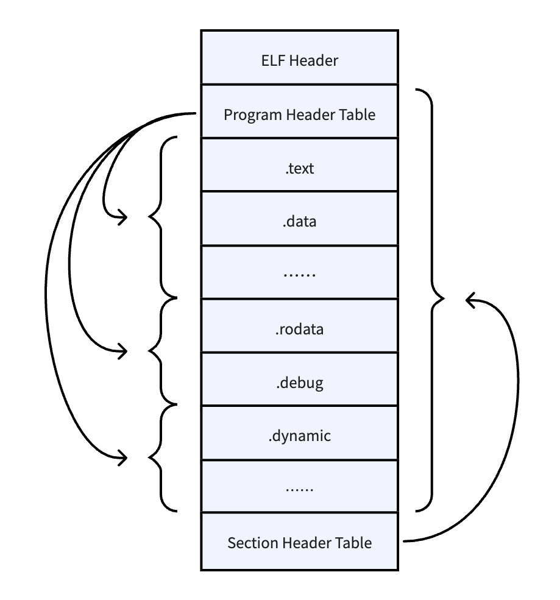
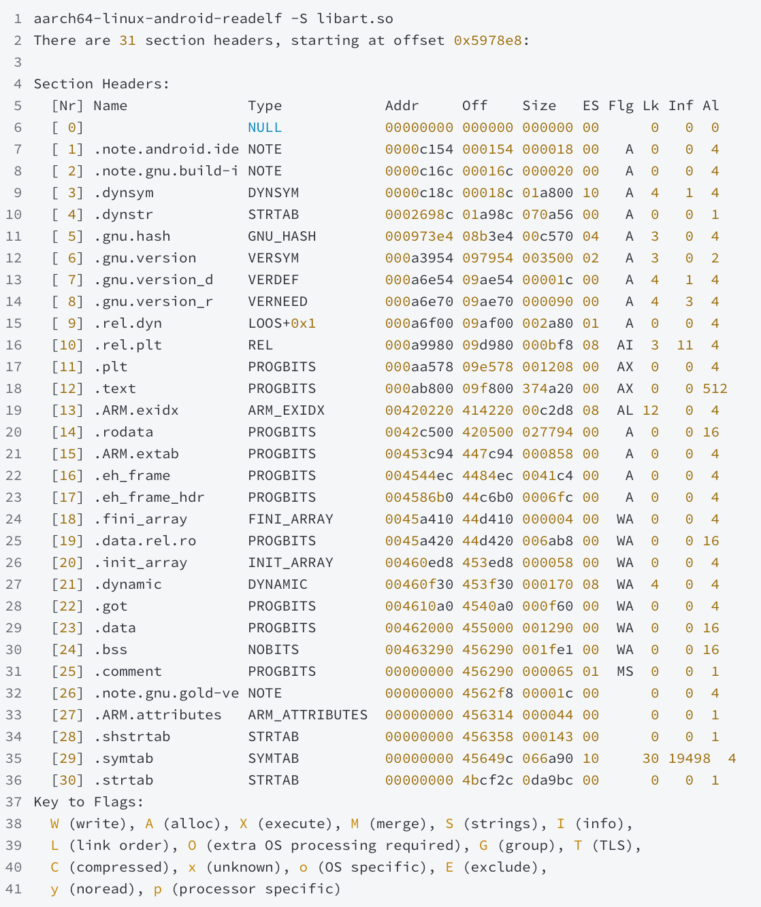
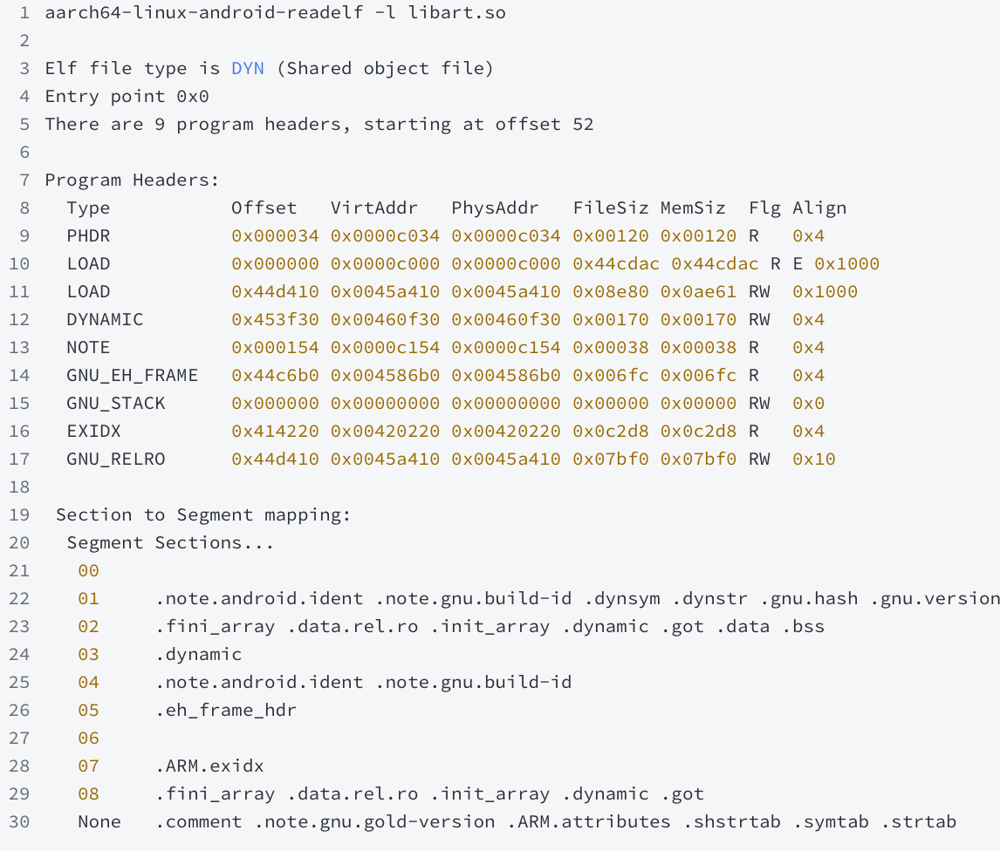
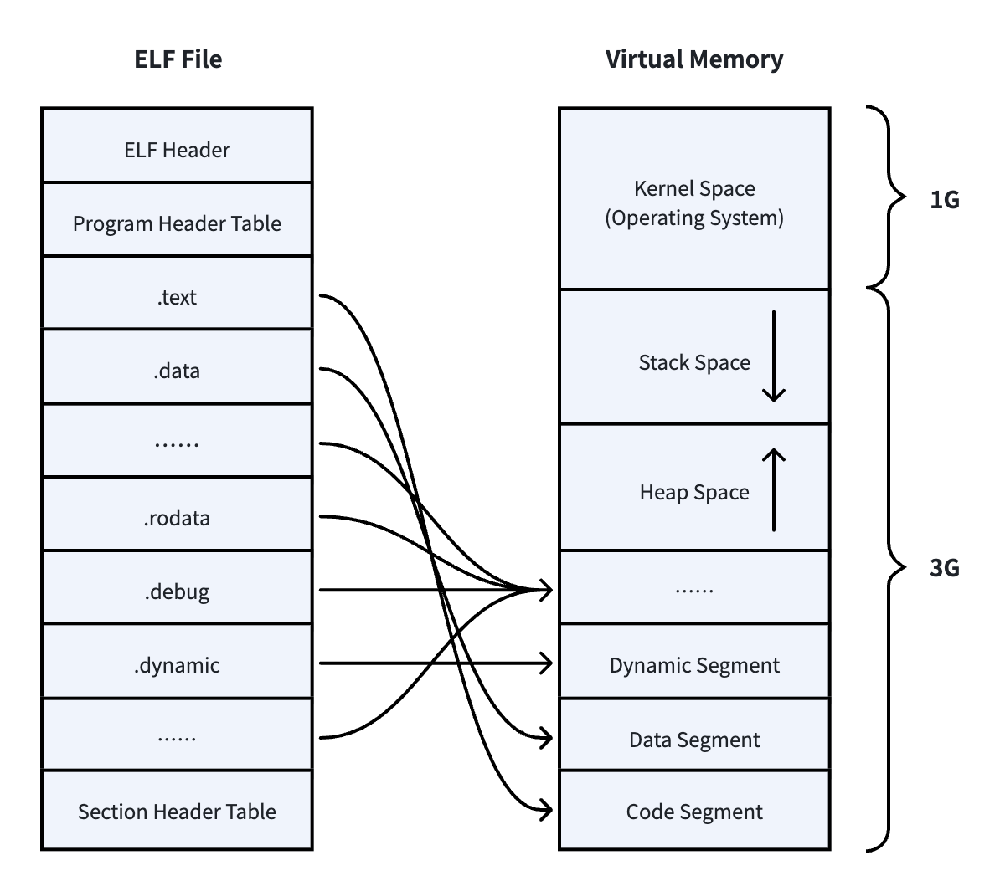
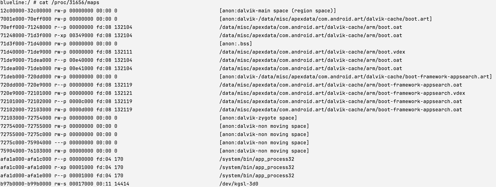
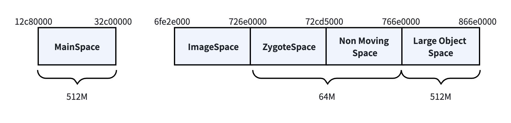
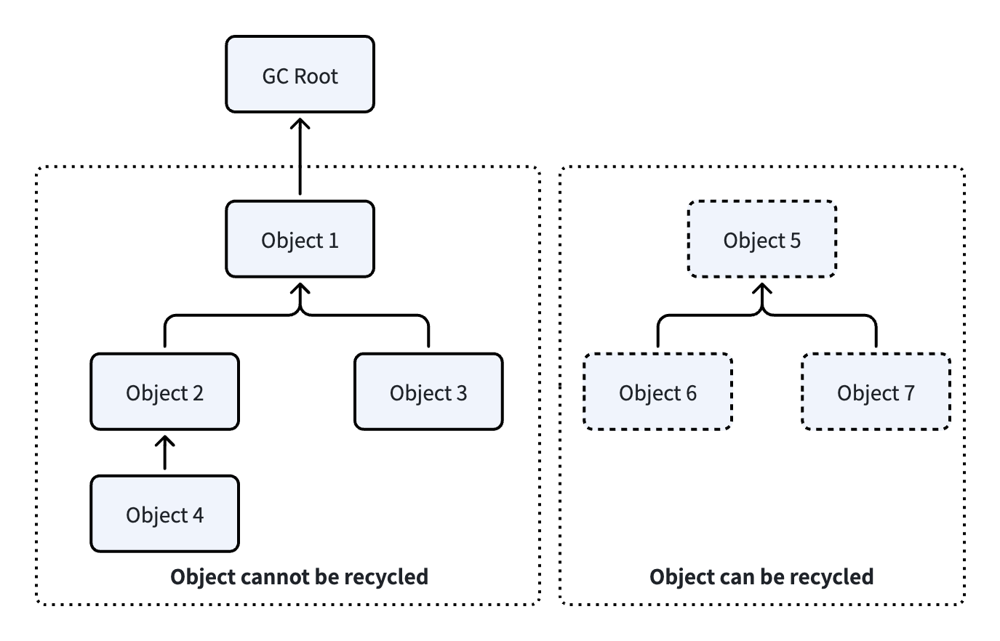

When doing anything, we first need to know the value of doing it, so that we have the motivation to do it well. So what is the value of memory optimization? There are mainly two aspects:&#x20;

1. When memory usage is high, processes may be forcibly terminated by the system's Low Memory Killer (LMK) mechanism. In more severe cases, an Out Of Memory (OOM) exception may occur, causing the program to crash. Therefore, performing memory optimization can improve the stability of the program.&#x20;

2. When memory usage is high, the Android Virtual Machine will frequently perform GC (Garbage Collection), or the Linux system will frequently perform paging. These processes will consume a significant amount of CPU resources, causing the application to become laggy. Therefore, optimizing memory can improve the smoothness of the program.&#x20;

It can be seen that the value of memory optimization is very obvious. In order to better carry out memory optimization, in this chapter, we will have a comprehensive and in-depth understanding of memory-related knowledge from the Linux system to the Android system. After having a certain knowledge reserve, we can then start to build a methodology for memory optimization. With the support of methodology, we can naturally carry out systematic and effective memory optimization.&#x20;

# 2.1 Virtual Memory

## 2.1.1 Why Virtual Memory is Needed

The operating systems we use daily all support running multiple programs simultaneously. From a technical perspective, this is not an easy feat to achieve. To support this feature, many issues need to be overcome. Here, I list a few of the most typical problems:&#x20;

* Memory address isolation issue

  For an operating system, applications cannot directly access real memory (also known as physical memory). If applications had such permissions, the memory addresses used by different applications would not be isolated from each other, and at this time, both malicious and non-malicious programs could easily overwrite the memory data of other programs, leading to serious problems such as data security issues or program crashes in the programs whose memory data has been overwritten.&#x20;

  Therefore, the operating system prohibits applications from directly accessing physical memory and creates an "intermediate layer" for each application process. Each process can only read and write data within its own unique "intermediate layer", and then the system maps the data in the "intermediate layer" to physical memory. In this way, different processes each have their own independent memory address space, can run independently without interfering with each other, thereby achieving memory address isolation between programs.&#x20;

* Memory usage efficiency issue

  To ensure the efficiency of program execution, the address space of programs loaded into memory is always contiguous. However, the capacity of memory is limited, so it is very likely that after loading a few programs, there will be no large contiguous blocks of memory available for the next program. At this point, if we want to continue executing a new program, we can only temporarily write the data of the previous programs back to the disk and read it back when needed later. During this process, there is a large amount of data swapping in and out, and the execution efficiency and performance of the program will naturally be very low. Therefore, if we want to improve the efficiency of memory usage, programs need to be able to use non-contiguous memory addresses, which conflicts with the execution efficiency of programs.&#x20;

  Therefore, the operating system creates a contiguous "intermediate layer", where all the data of the program is loaded, and then the system maps the contiguous addresses of the "intermediate layer" to non-contiguous physical memory addresses.

* Address stability issue

  When a program is running and wants to execute a certain function, it first needs to know the address of this function in memory. If the program is directly loaded into physical memory, it is very likely not loaded starting from address 0, but rather starting from an address somewhere in the middle. In this case, the address of the function is uncertain.&#x20;

  To solve the problem of uncertain function addresses, the operating system still assigns an independent "intermediate layer" to each process, and the addresses of this "intermediate layer" all start from zero. Since programs can only be loaded into this "intermediate layer", we can ensure that programs are always loaded starting from address zero, so the addresses of functions will not change and can be determined during the compilation phase.

From the above several typical problems, we can see that in order to solve these problems, operating systems all solve them by creating an "intermediate layer", which is virtual memory. It can be said that virtual memory is one of the most important technologies in modern operating systems.&#x20;

## 2.1.2 What is virtual memory?

So what is virtual memory? And how does virtual memory solve the various problems mentioned in the previous section? Let's continue reading.

Virtual memory technology is equivalent to allocating each process a exclusive and contiguous block of memory, except that this memory is virtual. The simplified model of virtual memory is shown in Figure 2-1. From the simplified model diagram, it can be seen that each process has its own unique virtual memory, which consists of system space and user space. The kernel space stores the operating system's data, and this data is the same across all processes, all mapped to the same physical memory segment; the user space stores the application's data. When an application writes data to the address of its corresponding virtual memory, the operating system will map the virtual address space to the actual physical memory address, and data can be written after the mapping is completed.&#x20;

The size of virtual memory is 2^32 bytes, i.e., 4GB, on a 32-bit system; on a 64-bit system, it is 2^48 bytes, i.e., 16TB. The reason it is not 2^64 ByteDance is that 2^48 bytes is already large enough, and the space of 2^64 bytes would only cause the system to consume more resources to maintain and manage this space. Virtual memory is managed and mapped to physical memory on a page basis, with each page being 4KB in size.&#x20;

Here, I assumes a scenario where a 32-bit system has only 2GB of physical memory, and uses the mapping model of virtual memory and physical memory as an example to help readers better understand. This scenario is shown in Figure 2-2, where the 4GB virtual memory is divided into 4194304 pages, each with a size of 4KB. When a page in virtual memory needs to write data, it maps a 4KB block of physical memory; if a page in virtual memory does not write data, no mapping occurs. The address mapping from virtual memory to physical memory is completed by the  memory management  unit (MMU) of the computer, which belongs to the hardware rather than the system software, so the mapping speed is very fast.&#x20;

## 2.1.3 ELF Files

Previously, we have learned that virtual memory consists of data from two parts: user space and kernel space. The kernel space stores operating system data, and this space is not accessible for applications to operate on. Applications can only operate on user space. Therefore, in this section, we will continue to gain a further understanding of user space.

All files that an operating system can execute must conform to a certain format. For example, in the Windows system,.exe program files and.dll library files are all in the PE (Portable Executable) file format. In Linux, executable files, including .o relocatable files and .so library files, are all in the ELF (Executable and Linkable Format) file format. When the system needs to execute a program, it first loads the data in the program into the virtual memory block of the user space. Therefore, to understand what data exists in the user space, we need to first understand the ELF file format, as shown in Figure 2-3:&#x20;

&#x20;An ELF file generally consists of an ELF Header, a Program Header Table, a Section Header Table, and multiple Sections, and their explanations are as follows:&#x20;

| ELF Header            | The ELF header is the first part of an ELF file, containing basic information about the file itself, such as file type, segment header table, entry point address, offset address of the program header table, etc.                                                                                                                                                                                                                                                                  |
| --------------------- | ------------------------------------------------------------------------------------------------------------------------------------------------------------------------------------------------------------------------------------------------------------------------------------------------------------------------------------------------------------------------------------------------------------------------------------------------------------------------------------ |
| Data Segment          | A unit used to organize and store specific types of data. Different Sections contain different types of data, such as code, data, symbol tables, relocation tables, string tables, etc., which will be introduced in detail later.                                                                                                                                                                                                                                                   |
| Segment Header Table  | An ELF file generally has only one section header table, which records the attributes of all data section (Section) information, such as name, size, offset, alignment, etc.                                                                                                                                                                                                                                                                                                         |
| Program Header Table  | The program header table reorganizes data segments according to their attributes or purposes. For example, segments with the same read-write permissions are grouped together, and this newly organized structure is called a program section. An ELF file may contain multiple program header tables. When the system loads an ELF file, it organizes and loads the corresponding data into memory according to the data segment information recorded in the program header table.  |

Let's continue to take a detailed look at these two parts: the data segment and the program segment.

### 1. Data Segment

By using the readelf tool provided in the Android NDK, execute the command "readelf -S xxx.so" to read the data segment information of the libart library. As shown in Figure 2-4, it can be seen that the art virtual machine library file has more than 30 data segments.&#x20;

Since the number of sections is relatively large, we will only introduce some of the most common data sections here:

* Code Segment (.text) :&#x20;

  Contains the machine instructions of an executable program. During runtime, the contents of this segment are loaded into memory and executed by the processor. The code segment typically has executable and read-only permissions.&#x20;

* Data Segment (.data) :&#x20;

  contains the initial values of the program's global and static variables. During runtime, the contents of this segment are loaded into a memory area that can be read from and written to. Therefore, the data segment usually has read and write permissions.&#x20;

* BSS Segment（.bss, Block Started by Symbol) :&#x20;

  Uninitialized global and static variables used to store programs. At runtime, the contents of this segment are initialized to 0 or null. BSS segments usually have read and write permissions

* Read-only Data Segment (.rodata):&#x20;

  contains read-only constant data in the program, such as string constants, constant tables, etc. During runtime, the content of this section is loaded into memory and has read-only permissions.&#x20;

* Debug Information Section (.debug):&#x20;

  contains information for debugging and symbol resolution, such as source code line numbers, variable names, function names, etc. This section is typically stripped in release builds to reduce file size.&#x20;

* Dynamic Table (.dynamic):&#x20;

  This paragraph mainly contains information about external dependency libraries, such as the names of external libraries, the addresses of external library functions, and other information.&#x20;

* Symbol Table (.symtab) :&#x20;

  This section mainly contains symbol information in the program. Symbol information includes the name, type, size, value, segment, etc. of symbols, which can be used for debugging, linking, disassembling, and other purposes. In the later chapters of this book, some technical solutions will use symbols, so here we will focus on explaining what symbols are. When a compiler compiles C++ source code into an object file, it will decorate the names of functions and variables to generate corresponding symbol names. Depending on the compiler, the generated symbols will also vary. The following table shows the compilation of the following functions and their corresponding symbols using the GCC compiler.&#x20;

  | function            | Symbol Name      |
  | ------------------- | ---------------- |
  | int func(int)       | \_Z4funci        |
  | float func(float)   | \_Z4funcf        |
  | int Test::func(int) | \_ZN4Test4funcEi |

  I takes the function int Test::func(int) as an example to explain. When GCC generates symbols for methods, they all start with \_Z. For nested names, N follows immediately, then the lengths and names of each namespace and class, so it's 4Test4func, and ends with E. Non-nested method names do not need to end with E. Finally, it's followed by the parameter types. So the symbol for this function is \_ZN4Test4funcEi. These symbol information will be bound to corresponding attributes such as types, information, addresses, etc., to form symbol entries and stored in the symbol table. The symbol table can mainly help us debug and locate problems during program execution. However, for the sake of package size and security, we often remove the symbol table from the so library during online runtime.&#x20;

### 2. program segment

We then use the readelf tool to execute the command "readelf -l libart.so" to read the program segment information of the libart library. As shown in Figure 2-5, we can see that the art virtual machine library file organizes the above 31 data segments (Section) into 9 program segments (Program Segment)

### 3. Structure of Virtual Memory

When the system executes a program file in ELF format, it loads the data segments in the ELF file into virtual memory in the order organized by the program headers and places them in the low-address area, i.e., the area where the virtual memory address starts from 0.&#x20;

After storing the data of the ELF file, the stack space and heap space follow. Among them, the stack space is automatically allocated and released by the compiler, and is used to store the parameter values, local variables, execution instructions, etc. of functions during function execution. The heap space is used for dynamic memory allocation and can be allocated and released by developers themselves, mainly implemented by the malloc and free functions. However, when developing Android applications through Java or Kotlin, we do not need to manually allocate and release the memory of the heap space, as the virtual machine program has already done it for us. The allocation address of heap memory is from bottom to top, and the allocation address of stack memory is from top to bottom. This way of opposite allocation can make full use of memory space, because if both the heap space and stack space allocate memory in the same direction, the size of the heap space must be limited to a fixed size to prevent the address from exceeding the bounds of the stack space when the heap space requests memory.&#x20;

Above the stack space is the system space, which is used to store operating system data. As shown in Figure 2-6, it is a structural model diagram of the ELF file and virtual memory in a 32-bit system. Through this model diagram, we can have a clearer understanding of the structure of virtual memory.

## 2.1.4 Virtual Memory Allocation and Deallocation

Applications cannot directly operate on physical memory, and they are unaware of physical memory. The only memory that applications deal with is virtual memory. Therefore, during the development of our programs, the memory allocated or requested is actually virtual memory. So how do we request virtual memory? What processes are involved? Let's continue reading.&#x20;

When developing Android applications, if we are doing Native development, we need to manually allocate or free memory. However, if we are only writing code at the Java layer, we do not need to allocate memory ourselves. When creating objects, declaring variables, constants, etc., the virtual machine will automatically allocate memory for these data. And after use, we do not need to free it ourselves; the virtual machine will automatically free this memory. The way the virtual machine allocates and frees memory is the same as the way we allocate and free memory in Native development, both using the malloc function to allocate appropriate memory for data in the heap space and freeing this block of memory through the free function after the data is used up.&#x20;

### 1. malloc function

Let's first take a look at the malloc function, which is very simple. When calling it, we only need to pass in the size of the memory we want to allocate. If the allocation is successful, it will return the address of a void\* pointer; if it fails, it will return NULL.

The malloc function is a function in the C language library, so when it allocates memory, it ultimately has to call functions provided by the Linux system, allowing the Linux kernel to help us allocate a block of memory. The kernel will execute different allocation strategies based on the size of the requested memory, mainly two strategies.&#x20;

1\) If the requested memory is less than or equal to 128KB, the kernel will call the sbrk() function to request memory. sbrk() will move the heap top pointer towards higher addresses to obtain new virtual Memory Space. This method is simpler and more efficient when allocating and freeing memory;

2\) If the requested memory is greater than 128KB, the kernel will call the mmap() function to allocate a Memory Space of the desired size in the heap. This method allows larger memory to be memory-aligned when requesting memory, thereby improving access efficiency.

### 2. mmap function

The mmap function is a very important function that we will encounter repeatedly later, so we will gain some understanding of this function here. The mmap function has two usages: the first is to map a file into the virtual memory of a process, allowing the process to read and write these objects through memory access; the second is to directly allocate an empty Memory Space in virtual memory without mapping a file. The function is as follows:&#x20;

The explanation for each input parameter of this function is as follows:&#x20;

* The parameter addr points to the starting address of the memory to be mapped, usually set to NULL, indicating that the system should automatically select the address, and returns this address upon successful mapping&#x20;

* The parameter length represents the size of the data mapped into memory&#x20;

* The parameter prot specifies the read and write permissions of the mapped region&#x20;

* The parameter flags specifies the characteristics during mapping, such as whether to allow other processes to map this memory segment, etc.&#x20;

* The parameter fd specifies the descriptor of the file mapped into memory&#x20;

* The parameter offset specifies the offset of the mapping position, typically 0.&#x20;

For the input parameter fd, we can either pass in the file address we want to map into user space or choose not to map a file. The explanations for these two usages are as follows:&#x20;

1\) To map a disk file into user space, pass the file we want to map as fd. This usage can make our file read and write operations more efficient and can be used to implement cross-process data transfer. For example, Android's shared memory mechanism and Binder communication are both implemented through mmap file mapping.

2\) Passing -1 as the fd input parameter indicates not mapping a disk file but instead allocating a block of memory on the heap. The malloc() function of the virtual machine uses this usage and directly allocates a block of memory in the Java heap space.

The memory allocated by malloc is all virtual memory, and at this time, the real physical memory is not allocated or mapped. Only when we actually write data to this virtual memory area, the operating system checks that the corresponding virtual memory is not mapped to physical memory, a page fault interrupt occurs, then allocates a physical memory of the same size and establishes a mapping relationship. This is a lazy loading technique that can improve memory usage efficiency.&#x20;

### 3. free function

To release memory, we call the free function. We only need to pass in the starting address to be released, which is the address returned after calling the malloc function. We do not need to pass in the size of the memory to be released because the memory management mechanism has already recorded the size information of the memory block allocated to this address. When the allocated memory is no longer needed, be sure to call free to release it; otherwise, a memory leak will occur.&#x20;

## 2.1.5 Virtual Memory to Physical Memory

Calling the malloc function only allocates a block of virtual memory space. This virtual space contains no data and does not occupy any real physical memory. Only when we write data to this memory will it consume physical memory. Readers can understand the entire process of allocating memory, writing data, and freeing memory through the following code.

When we write data to the allocated memory, the process is as follows:&#x20;

1\) Trigger a page fault: When writing data to a specified memory address, if the page at that address is not mapped to a physical memory page at this time, a page fault will be triggered, and the operating system will then capture this interrupt.

2\) Allocate physical memory: When the operating system catches this interrupt exception, it first checks whether the accessed virtual memory page is legal, that is, whether it is within the address space of the process. If it is legal, it will allocate a physical memory page for the virtual memory page. If the physical memory is already full, the operating system may trigger a page replacement algorithm to swap out some infrequently used physical memory pages to the disk, thereby freeing up space to allocate a new physical memory page.

3\) Update the page table: Once a physical memory page is allocated, the operating system will update the page table of the process to map the virtual memory pages in the process to the newly allocated physical memory pages.

4\) Write data: After the operating system completes the page table update, the program will continue to execute, and at this time the above code can continue to complete the data writing operation.

# 2.2 Composition of Memory Data

The core of the Android system is the Linux system, so the memory space model of processes under the Android system is the same as that of Linux. From the perspective of Linux, at this time, the program carried by each process is actually the ART virtual machine program, which then allocates memory from the heap for the program actually running on this virtual machine. Therefore, the memory composition of processes in the Android system actually consists of two parts: the virtual machine and the program running on the virtual machine. As Android developers, what we often care more about is the memory area allocated by the virtual machine for the program, and we will then understand the data composition of this memory area.&#x20;

## 2.2.1 maps File

To clearly understand the composition of memory data in Android processes, we first need to understand the maps file. In Linux systems, the file at the path /proc/{pid}/maps records the data information mapped by the virtual memory of each process, where {pid} is the process ID.

For rooted phones, we can directly view the maps file of a certain process through the command cat /proc/xxx/maps. Figure 2-7 shows partial maps file data of a certain program in the Android system:&#x20;

Taking the first row of data as an example, the explanations for each data segment from left to right are as follows:

* 12c00000-32c00000 (address): The range of virtual address space mapped by this memory segment

* rw-p (permissions,): Access permissions for this memory region

* 00000000 (offset value,): The offset of the mapped address of this paragraph in the file

* 00:00 (device number): The device number of the device to which the mapped file belongs. It consists of two parts: the major device number and the minor device number. The major device number is used to identify the type of device, such as a character device or a block device; the minor device number is used to identify a specific device within the same type of device. If it is an anonymous mapping, such as heap, stack, etc., then it is 00:00

* 0 (inode): Represents the inode number of the mapped file. An inode can be used to identify the content and attributes of a file without relying on the file name. The file name is just an alias for the inode, and multiple file names can point to the same inode. If it is an anonymous mapping, it is 0

* &#x20;\[anon:dalvik-main space (region space) ] (pathname): Represents the pathname of the mapped file, and is empty if it is an anonymous mapping&#x20;

## 2.2.2 Java Heap Memory

Having understood the meanings of each data segment in the maps file, let's take a look at the data in each column. What are the data named "dalvik-main space", "boot.art", "boot-core-libart.art", "……" that appear in Figure 2-7? In fact, when the Android virtual machine starts, it creates the Java heap space. Therefore, the mapping data recorded in many of the preceding columns in the maps file all belong to the Java heap data.&#x20;

### 1. Composition of Heap Memory

When the Android Virtual Machine starts, the Java heap is created, and all subsequent memory required for Java objects will be allocated from this heap. So, let's first understand the composition of the Java heap. The Java heap consists of MainSpace, ImageSpace, ZygoteSpace, NonMovingSpace, and LargeObjectSpace,  these five parts. The following is a description of each component.&#x20;

* MainSpace: In the program, all Java object data except large objects will be stored in this space, which is the core storage area during program runtime.

* ImageSpace: An object used to store system library objects, such as objects under the java.lang package, objects in android.jar, etc. The size of this space is not fixed.

* ZygoteSpace: This space is adjacent to ImageSpace and is used to store the basic resources and objects required when a process starts. These objects will not be reclaimed by the GC mechanism. When a new application process is created from the Zygote process through the fork operation, the application process will inherit the resources in ZygoteSpace, which can improve the efficiency of application startup because there is no need to reload these resources. The size of ZygoteSpace in the Zygote process is 64 MB, but in non-Zygote processes, only about 2 MB will be retained because non-Zygote processes only need these 2 MB of resources, so this can free up more space for other resources to use.

* NonMovingSpace: When a non-Zygote process starts, it will split approximately 62 MB from ZygoteSpace, retaining only the 2 MB space that is needed. The remaining space is called NonMovingSpace, which is used to store some objects with a longer lifecycle.

* LargeObjectSpace: Used to store large objects, i.e., primitive type arrays and String objects larger than 12 KB.

As can be seen from the maps file in Figure 2-6, the address range from 12c00000 to 32c00000 is exactly 512 MB in size and belongs to MainSpace. The addresses from 6fe2e000 to 726e0000 belong to ImageSpace, totaling approximately 40 MB, which stores various system-related libraries. Immediately following ImageSpace are ZygoteSpace, NonMovingSpace, and LargeObjectSpace, as shown in Figure 2-8.&#x20;

### 2. Heap Creation

Having understood the composition of the Java heap, we can then read the source code to understand the creation process of the Java heap, whose source code is located in heap.cc file. For ease of reading, I have streamlined the source code and split the entire process into 6 parts.

1\) Let's first look at the first part, and the code is as follows. The code in this part is mainly used to create ImageSpace, which is primarily used to load the boot.oat library, a part of the ART virtual machine.

2\) The code in the second part is mainly about creating ZygoteSpace, and the code is as follows.

3\) The code in the third part mainly creates MainSpace. According to the code logic, if the type of the foreground GC mechanism (foreground\_collector\_type\_) is not Concurrent Copying (kCollectorTypeCC), a space named "main space" with a size of capacity\_, where capacity\_ is equivalent to the size configured by the system "dalvik.vm.heapsize" (mostly 512 MB), will be created. If the foreground or background GC mechanism is Semi-Space GC (kCollectorTypeSS), a space named "main space 1" will be created. Only the GC mechanisms in systems between Android 5 and Android 7 meet these two conditions, so two spaces named "main space" and "main space 1" will be created in these systems.

4\) In the code of the fourth part, the previously created ZygoteSpace will be managed through DlMallocSpace, as shown below.

5\) In the code of the fifth part, it will check if the foreground GC mechanism is concurrent copying collection. If so, it will create a space named "main space (region space)" with a size of 'capacity\_' \* 2, which is 1 GB in total. However, on some devices, 'capacity\_' has been adjusted to 256 MB, in which case the total space is only 512 MB, and it will be directly placed into RegionSpace for management. Since the foreground GC mechanism is concurrent copying collection only in Android 8 and above, this space will only exist in Android 8 and above systems. From the first line of the maps file in Figure 2-5, we can also see the 512 MB "main space (region space)".

If the foreground GC mechanism is not concurrent copying and recycling, that is, in versions below Android 8, it will first determine whether the foreground GC mechanism is MovingGc. If so, the two spaces "main space" and "main space 1" created in the third part will be respectively placed into two BumpPointerSpaces for management.&#x20;

In other cases, both the "main space" and "main space 1" Memory Spaces are placed into MallocSpace for management.&#x20;

6\) The code in the last part mainly creates the LargeObjectSpace, implemented as follows.

By reading the source code of heap creation above, we can know that in Android 5 to Android 7 versions, spaces named "main space" and "main space 1" with a size of 512M each will be created, and both main space and main space 1 will be maintained and managed through MallocSpace. In actual use, only one of the spaces will be used, and only when GC is executed will the other space come into play. At this time, the GC collector will move all the live objects in the previously used space to the other space. In Android 8.0 and above versions, main space (region space) is created and maintained and managed through RegionSpace.&#x20;

In the creation process of the Java heap, we can also find that all Memory Spaces will first apply for a block of virtual memory through mmap, and then place this memory into the corresponding space for management. The following briefly introduces the space used to manage memory:&#x20;

| Space                                  | Explanation                                                                                                                                                                                                                                                                                                                                                                                                                                                                               |
| -------------------------------------- | ----------------------------------------------------------------------------------------------------------------------------------------------------------------------------------------------------------------------------------------------------------------------------------------------------------------------------------------------------------------------------------------------------------------------------------------------------------------------------------------- |
| DlMallocSpace                          | Memory is allocated and freed through the dlmalloc memory allocator, which uses data structures such as separate free lists and bitmaps, enabling it to efficiently handle small memory allocation requests. However, it has lower efficiency for large memory allocations and suffers from a certain degree of memory fragmentation issues.                                                                                                                                              |
| MainMallocSpace                        | Memory allocation and deallocation are performed through the rosalloc memory allocation manager developed by Google. The usage of rosalloc is much more complex than that of dlmalloc, and it also requires cooperation from other modules in the ART virtual machine. However, the allocation effect is better than that of dlmalloc, effectively reducing the generation of memory fragmentation, and it performs better under multi-threading, but with greater performance overhead.  |
| BumpPointerSpace                       | A very simple memory allocation algorithm that allocates sequentially, similar to a linked list, is prone to memory fragmentation, so it is only used in thread-local storage or object spaces with a very long lifespan.                                                                                                                                                                                                                                                                 |
| RegionSpace                            | The memory allocation algorithm of RegionSpace is slightly more advanced than that of BumpPointerSpace. It first divides memory resources into memory blocks of a fixed size (specified by kRegionSize, defaulting to 1MB), with each memory block represented by a Region object. When performing memory allocation, it first finds a Region that meets the requirements, and then allocates resources from this Region.                                                                 |
| FreeListSpace LargeObjectMapSpace | Allocating and freeing memory through list or map is simpler than BumpPointerSpace.                                                                                                                                                                                                                                                                                                                                                                                                       |

Different GC algorithms have different space requirements. For example, the mark-sweep algorithm only requires one space, while the copy collection algorithm requires two spaces. The properties of different objects also have different space requirements. For example, system objects have a very long survival cycle and need to be placed in spaces with a longer life cycle, while some application objects have a very short survival cycle and need to be uniformly placed in spaces with a shorter life cycle. Therefore, during the process of creating the Java heap, so many spaces emerge. These spaces have different mechanisms for memory allocation and deallocation, and different GC algorithms. The system will select the appropriate space based on different scenarios.&#x20;

### 3. Java Object Allocation and Release

Although the Java heap consists of many spaces, in fact, Java objects in application code are almost always stored only in the MainSpace and LargeObjectSpace, while other spaces are used by system libraries. So, let's take a look at how the memory required for Java objects is allocated and released in the MainSpace and LargeObjectSpace.

1\) Application Process

There are two ways to create and load an object in Java, namely explicit loading and implicit loading. Explicit loading uses the `Class.forName` or `ClassLoader.loadClass` method to load the object. Implicit loading uses the new keyword, reflection, accessing Static Variables, etc., to load the object. Both of these two ways will eventually call the `AllocObjectWithAllocator` method to allocate memory in the Java heap. This method is located in heap-inl.h file. Below is the simplified logical code of this memory allocation function.

Through the above code process, it can be seen that if the Java object applying for memory is a large object, AllocLargeObject will be called to allocate in LargeObjectSpace; if not, TryToAllocate will be called to allocate in MainSpace. If the allocation fails, GC will be executed and then the allocation will continue.&#x20;

What is a large object? From the code of the `ShouldAllocLargeObject` judgment interface below, we can see that an object is considered a large object if the requested memory is greater than or equal to large\_object\_threshold\_ (which is 12 KB) and it is a primitive type array or a string.

2\) Release Process

After understanding the object allocation process, let's take a look at the object deallocation process. When allocating memory in the Java heap, if the allocation fails or the total memory size exceeds the threshold after allocation, GC will be executed. In the above allocation process, we can see that after a memory allocation failure, the AllocateInternalWithGc interface will be called to reallocate memory. This interface will call the CollectGarbageInternal method located in the heap.cc  file to perform GC, and the code is as follows.&#x20;

The logic of this interface is relatively simple, mainly doing the following two things:&#x20;

1. Select an appropriate garbage collector and configure its environment. For example, semi-space collection (kCollectorTypeSS) sets up the source space (FromSpace) and the destination space (ToSpace).&#x20;

2. Then call and execute the collector->Run interface, which will execute the garbage collector object's collection strategy.

Different garbage collectors correspond to different GC algorithms. The knowledge in this area is quite extensive and goes beyond the scope of this chapter, so we will not provide a detailed introduction. Here, we will only introduce how a garbage collector determines whether an object is recyclable, which can help us better understand memory optimization.&#x20;

For the garbage collector of the ART virtual machine, it determines whether an object can be reclaimed through reachability analysis. The garbage collector analyzes the reference chain of each object in the space. If the reference chain of an object is ultimately held by a GC Root, it means that the object cannot be reclaimed. Otherwise, it can be reclaimed. As shown in Figure 2-9, although objects 6 and 7 are held by object 5, object 5 is not held by GC Roots, so the garbage collector will determine that objects 5, 6, and 7 are all objects that can be cleared and reclaimed, while the reference chains of objects 1, 2, 3, and 4 are held by GC Roots, so they cannot be cleared and reclaimed by the garbage collector.&#x20;

GC Roots mainly include the following items:

* Objects referenced in the stack: Each thread creates a thread stack when it executes, so as long as an object is referenced in this stack, it will not be released until the thread exits.

* Objects referenced by static variables and constant references: Objects referenced by static variables are also reachable from GC Roots, and only when we manually set them to null can we release these objects.

* Objects referenced by Native methods: Objects that are passed to the Native layer through JNI (Java Native Interface) calls and referenced by Native functions cannot be released either.

## 2.2.3 Native Memory

Compared to Java heap memory, Native memory mainly consists of two parts: one is the occupancy of Bitmap. Since Android 8, Bitmap memory has been counted as Native memory, and Bitmap's Memory Space is actually allocated through the malloc function; the other is the memory allocated by memory allocation functions such as malloc, calloc, realloc , mmap  in the so library. Although Native memory has a relatively simple composition, it is much more difficult to manage than Java heap memory. In the subsequent practical chapters, we will further master the knowledge of Native memory and its management.

# 2.4 Methodology for Memory Optimization

From the previous knowledge points, we can know that memory is divided into two parts: virtual memory and physical memory. Virtual memory is the memory allocated through the mmap function, but no data is actually written to it. Physical memory is the memory that is consumed only after data is written. When the consumption of either virtual memory or physical memory exceeds the threshold, it will lead to OOM. Therefore, when optimizing memory, we must first clarify whether we are optimizing virtual memory or physical memory. If we are optimizing physical memory, then our optimization direction can be further divided into Native memory or Java memory. Whether it is the optimization of virtual memory or physical memory, the methodology for optimization is the same, mainly including three aspects: timely data cleaning, reducing data loading, and increasing memory size.

## 2.4.1 Clean up data in a timely manner

Optimization solutions designed through the methodology of timely data cleaning are often application-layer optimization solutions, which are generally easy to implement and have good results. In most cases, we only need to clean data in two situations: at the end of the business and when memory is insufficient.&#x20;

* At the end of the business

At the end of the business operation, some data needs to be manually cleaned up by us, such as global cache and resources. Some data will be automatically cleaned up, such as Activity and its member variables. For data that needs to be manually cleaned up, we should avoid null exceptions caused by the continued use of this data in business operations after cleanup. Since cleaning up this type of data is prone to exceptions, we should best exercise caution or, if possible, convert the global data that needs to be manually cleaned up into member data within Activity.&#x20;

For an Activity, once it has been destroyed, as long as this Activity is not held for a long time by an object elsewhere, when the virtual machine performs garbage collection (GC), this Activity and its member variables will be reclaimed and released. In reality, for data that is automatically cleaned up when such business operations end, most of our optimizations focus on the investigation and management of leaks. However, we can also add some defensive optimization strategies in addition to investigation and management. For example, we can change the code that holds the Activity's context to hold the Application's context. If it is not possible to hold the Application's context, the Activity's context should be held with a weak reference.&#x20;

* When memory is insufficient&#x20;

In addition to when the business ends, we also need to proactively clear non-essential objects and data when there is insufficient memory. For example, when Java heap memory is insufficient, we can implement strategies such as cleaning the cache in the application. So how can we know that the Java heap is insufficient? This requires adding a detection mechanism. We can start an independent sub-thread and then perform detection at regular intervals to obtain Java heap information. The information can be obtained either through AMS to get meminfo or through the Runtime.getRuntime() interface. However, in this scenario, using Runtime.getRuntime() is appropriate because it has the least performance overhead, and we only need to know the maximum memory and used memory of the Java heap.&#x20;

Once we obtain the maximum available memory and the used Java heap memory, we can determine whether the memory usage has exceeded the threshold we set. If it has, we will notify each business, cache, singleton object, etc. through a callback to perform cache cleanup.&#x20;

## 2.4.2 Reduce data loading

To reduce the data loaded into the Java heap, we can achieve this by reducing cache size, loading data on demand, and transferring data.

**1) Reduce cache size**

Inevitably, a lot of caches are needed in business development. Caching is an effective way to improve performance by trading space for time. The more caches are used, the more memory is occupied. Naturally, reducing the use of caches can also reduce memory usage. However, reducing the cache size may conflict with the business experience. At this time, we need to comprehensively evaluate multiple factors such as business experience, OOM rate, and business usage frequency to minimize the cache size. How should we operate specifically? Take LruCache (Least Recently Used Cache) as an example. It is one of the most commonly used cache containers. To optimize caches like LruCache, we need to consider the following points:&#x20;

* What is the capacity of the cache?

* When will the data in the cache be cleared?&#x20;

Let's first look at the first question. The LruCache constructor requires setting the capacity size of this LruCache. Many articles online mention that the default value passed in is one-eighth of the maximum available heap memory, but this setting is actually not very accurate. We need to evaluate the importance of the business and the frequency of business usage. If it is a cache for an important and frequently used business, it is acceptable to set a larger capacity here. At the same time, we also need to evaluate the current device model. If it is a low-end device with only 256MB of available heap memory, setting it to one-eighth, which is 32MB, is a bit too much and may have a certain impact on the stability of the entire application. So, exactly how much should it be set? It is recommended to fully consider the device model and business before setting. There is no absolute standard here, and the developers of the application need to evaluate it based on the actual scenario and business.

Now let's look at the second question: when should the data in the cache be cleared? LruCache comes with its own cache clearing strategy. Once the cache reaches its capacity limit, it will clear the last recently unused data. In addition to this clearing strategy, we can add more strategies, such as clearing the data in LruCache when Java heap memory usage reaches a threshold (e.g., 80%).

In addition to LruCache, commonly used collection containers also include List, Map, etc. When optimizing memory, we also need to consider issues such as how much memory they occupy during runtime, whether there will be memory exceptions caused by excessive memory usage, and how to clean them up in a timely manner.&#x20;

**2) Load data on demand**

Lazy loading data means that data is only loaded when we actually need it. The Android system uses a large number of lazy loading strategies. For example, the mmap function mentioned earlier actually requests virtual memory, and physical memory is only allocated and mapped when data actually needs to be stored. In application development, using the lazy loading data strategy can save a significant amount of Java heap memory.&#x20;

In project development, we also have many scenarios where this strategy can be applied. For example, we usually register various global services into a service container in the project, expose the capabilities of each business through the service interface, and achieve the purpose of decoupling. In many cases, we perform registration when the program starts or the business initializes. However, if we adopt the principle of loading data on demand and delay the registration logic until the service is actually needed, it can optimize performance. In addition, it also includes various preloading operations during application startup, and we can also consider whether to perform the loading when it is actually needed.&#x20;

**3) Transfer data**

We know that the size of the Java heap is limited, and the available size under mainstream models is only  512 MB . So, if we transfer the data that needs to be placed in the Java heap to other locations, can we break through the 512 MB limit? In fact, we can indeed do so, and there are mainly the following two ways to transfer data:&#x20;

* Transferring Java heap data to Native: Regarding this optimization strategy, Bitmap is a classic example. Before Android 8.0, Bitmap was counted towards the Java heap space, but in Android 8.0 and later versions, Bitmap is placed in Native. This strategy significantly increases the available space in the Java heap. Before Android 8, the image loading tool Fresco also adopted a solution that placed the creation of Bitmap in Ashmem anonymous shared memory to optimize Java heap memory. It can be seen that both the Android system and the Fresco framework optimize Java heap memory by transferring data originally stored in the Java heap to Native. Therefore, we can also use this approach when optimizing Java heap memory. For example, we can move business operations that require reading Big data to the Native layer, including network libraries and business data processing. Even for Bitmap, in versions below Android 8.0, it can be transferred to Native through technical means such as Native Hook.

* Transfer the data in the Java heap of the current process to other processes: The Java heap of each process is fixed, but we can design the application as a multi-process model, so that multiple Java heap spaces are available. We can choose to place relatively independent business operations in child processes, such as those that need to be hosted by containers like Mini Programs, Flutter, RN, Webview, etc. After we place these business operations in independent child processes, we can not only reduce the size of the Java heap in the main process but also mitigate performance issues such as memory leaks and crashes caused by these operations in the main process.

## 2.4.3 Increase Memory Space Size

Regarding the memory optimization methodology of increasing memory size, readers may wonder, isn't the memory size fixed for a device? So how can we increase it? From the previous basic knowledge, we also know that although the sizes of physical memory and the virtual memory created by the system for processes are both fixed, there are many other memory spaces created by virtual machines or system libraries. For example, the Java heap space, which defaults to 512 MB, is created and managed by the virtual machine, and the thread stack space, which defaults to 1024 KB, is created by the libc system library. Therefore, we can use Native Hook technology to change the logic of system libraries or virtual machines, thereby achieving the optimization of changing the sizes of these spaces and increasing memory space.

However, changing the logic of system libraries through Native Hook to increase memory size is not a very conventional optimization solution, because when implementing these optimization solutions, we not only need to be familiar with the underlying logic and source code but also need to be familiar with Native Hook technology. A classic example is ByteDance's mSponse memory optimization solution, which uses Native Hook technology to free LargeObjectSpace from the idle state of its original space size and allocates an independent 512 MB space.

In addition to expanding the available memory space, we can also indirectly increase the available memory size by reducing the space in the memory space that is occupied by the system but not actually used. This method is often used in the optimization of virtual memory and will also be further explained through practical cases in the following chapters.&#x20;

| Source code appearing in this chapter: heap.cc: <https://cs.android.com/android/platform/superproject/+/main:art/runtime/gc/heap.cc> heap-inl.h: <https://cs.android.com/android/platform/superproject/+/main:art/runtime/gc/heap-inl.h> |
| ---------------------------------------------------------------------------------------------------------------------------------------------------------------------------------------------------------------------------------------------- |
